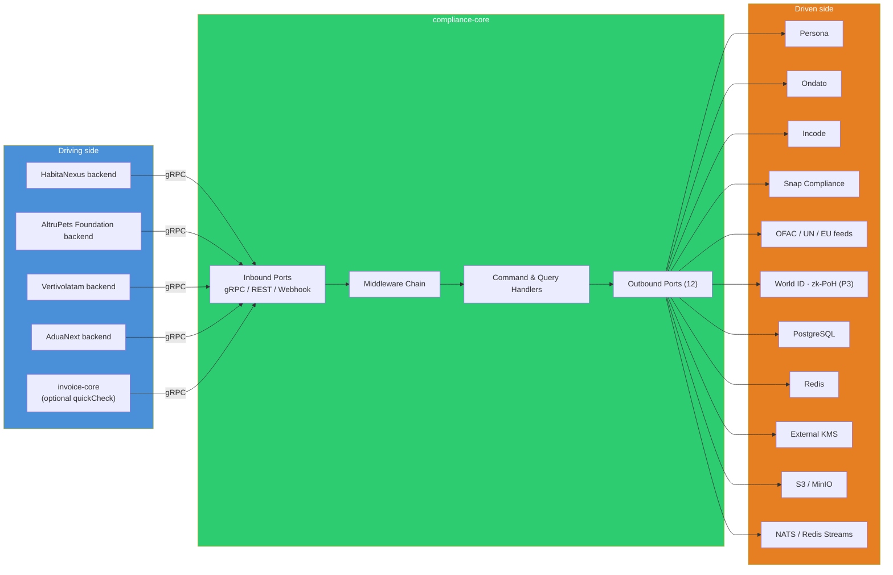
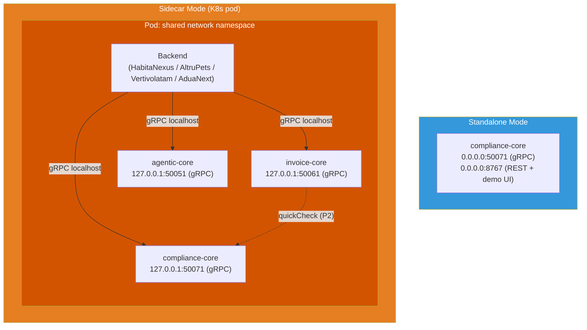
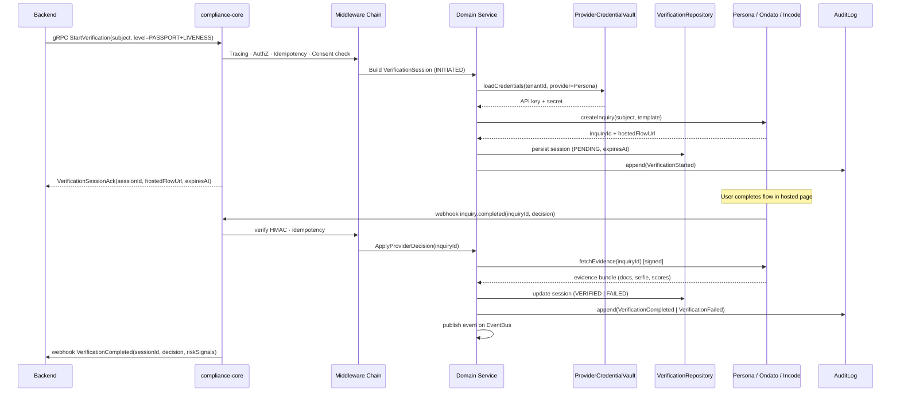
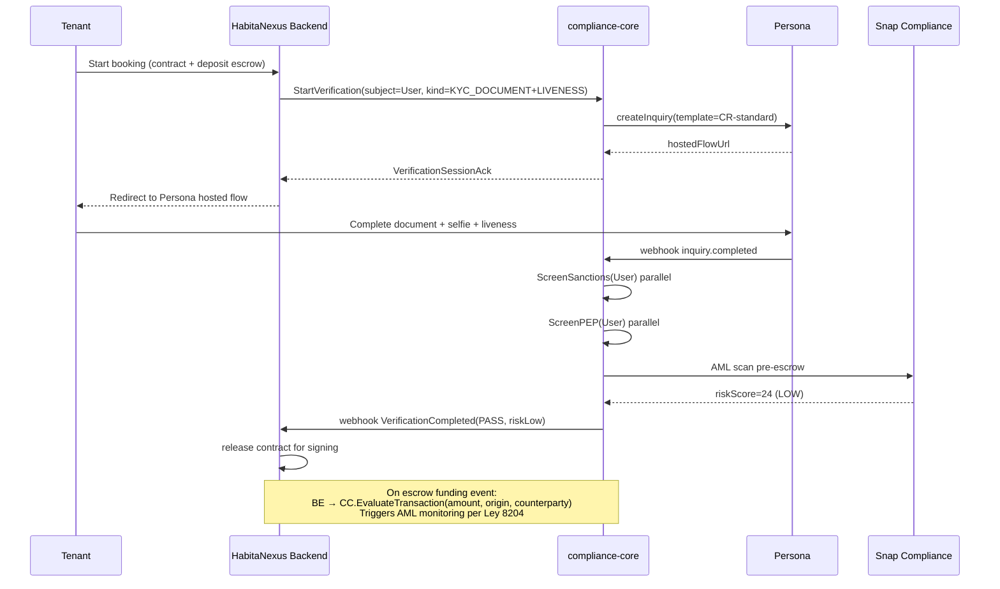
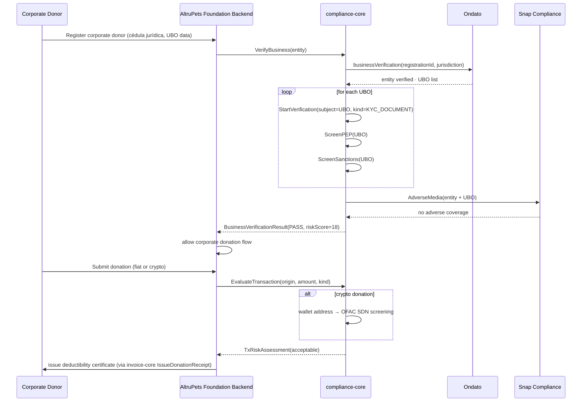
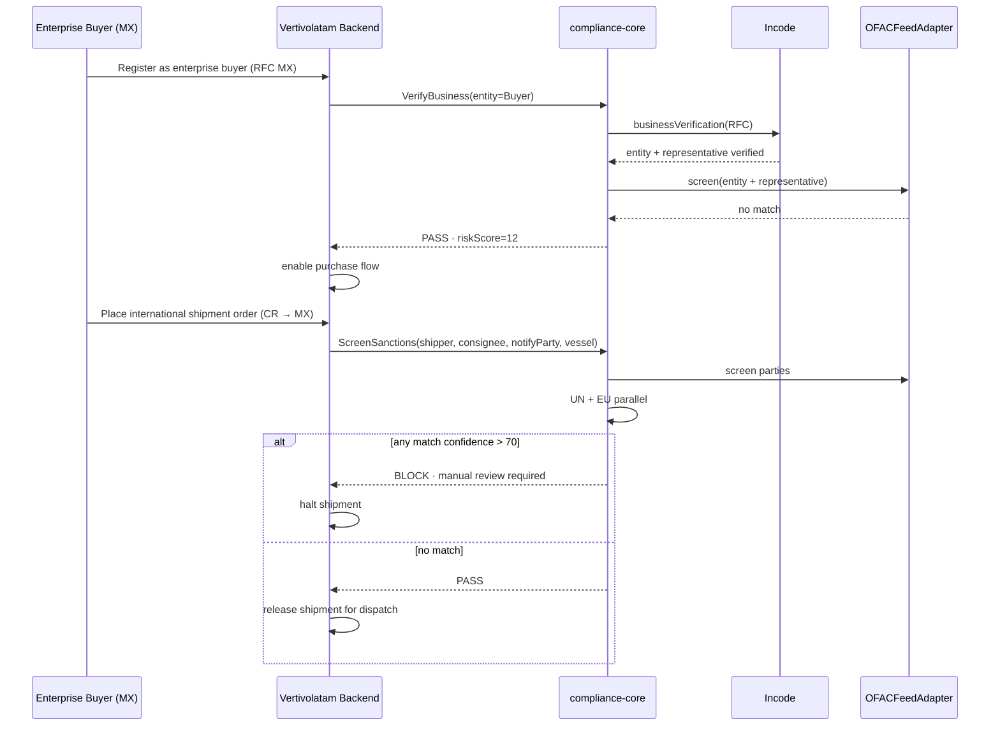
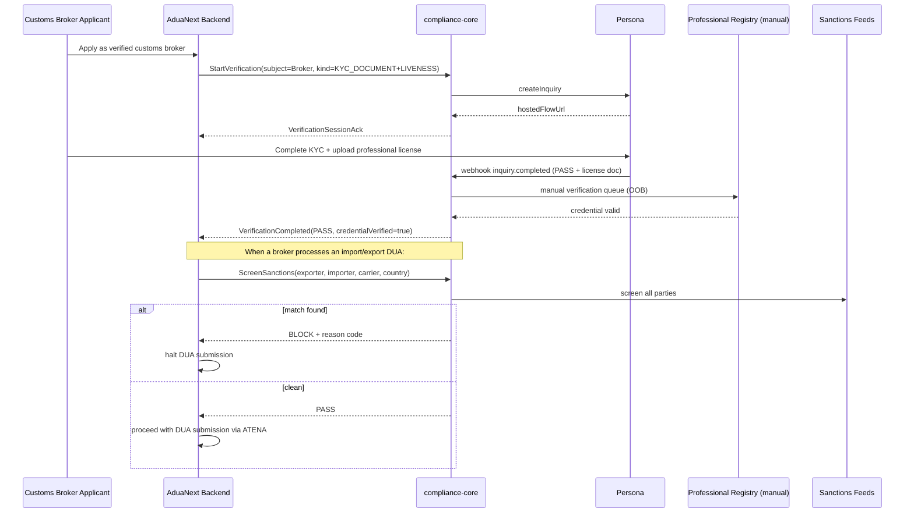

# compliance-core — Design Specification

**Fecha**: 2026-04-16
**Autor**: @lapc506 (Luis Andrés Peña Castillo / andres@dojocoding.io)
**Estado**: **APROBADO** por el autor tras ronda de governance 2026-04-16 (5/5 con múltiples ✅✅ en rúbrica).
**Licencia del diseño**: BSL 1.1 (igual que el código).
**Prioridad**: **#2 inmediata** — siguiente `-core` después de `invoice-core`. Driver regulatorio: Ley 8204 CR aplica al escrow de HabitaNexus desde día uno (> USD 1000/mes). Sin KYC formal el escrow cae en "actividad financiera no supervisada" ante SUGEF.
**Siguiente paso**: invocar `superpowers:writing-plans` para generar implementation plan con issues Linear (fases 1-5).

---

## Documentos complementarios

- `/home/kvttvrsis/Escritorio/2026-04-16-core-governance-rubric.md` — rúbrica 5/5 que aprobó este `-core` (§3 criterios, §5 verdicto).
- `/home/kvttvrsis/Documentos/GitHub/invoice-core/docs/superpowers/specs/2026-04-16-invoice-core-design.md` — spec del `-core` predecesor; patrón y rigor replicados aquí.
- `/home/kvttvrsis/Escritorio/2026-04-16-invoice-core-hallazgos.md` — hallazgos §8 (Ley 8204 HabitaNexus escrow) y §13 (referencias Compliance/KYC/PoP que originaron la lista de providers).
- `/home/kvttvrsis/Documentos/GitHub/agentic-core/README.md` — patrón arquitectónico (Python + BSL 1.1 + hexagonal + sidecar).
- `/home/kvttvrsis/Documentos/GitHub/marketplace-core/README.md` — patrón arquitectónico (TypeScript + hexagonal + gRPC).

---

## 1. Contexto y motivación

`compliance-core` es la cuarta librería compartida del ecosistema personal de @lapc506 — junto a `agentic-core` (Python, AI agent orchestration), `marketplace-core` (TypeScript, product catalog + traceability) e `invoice-core` (TypeScript, facturación electrónica multi-país). Cubre el hueco explícito que `marketplace-core/README.md` declara (*"KYC / Identity verification — not provided"*) y que `invoice-core` difiere (*"NO KYC/AML — futuro compliance-core"*).

### Problema

Las 4 startups del portafolio requieren capacidades de cumplimiento regulatorio que son imposibles de resolver con adapters aislados por backend:

- **HabitaNexus** opera escrow de alquileres de corto plazo en CR. La Ley 8204 (contra legitimación de capitales) aplica a cualquier plataforma con movimiento mensual > USD 1000 — umbral que el escrow cruza desde el primer contrato. Sin KYC formal, sin AML transaction monitoring y sin lista SUGEF de Personas Expuestas Políticamente (PEP), el producto es insostenible regulatoriamente.
- **AltruPets Foundation** recibe donaciones que deben acreditar **origen lícito de fondos**. Donantes corporativos exigen verificación KYB (Know Your Business) y Ultimate Beneficial Owner (UBO) tracking. Donaciones cripto requieren screening OFAC de wallets.
- **Vertivolatam** vende insumos agro-industriales B2B cross-border (CR → GT/MX). Sanctions screening es requisito para despachos internacionales (OFAC Specially Designated Nationals (SDN), UN Security Council consolidated list, European Union (EU) sanctions).
- **AduaNext** integra agentes aduaneros que son profesionales regulados. Requiere verificación de credenciales profesionales y screening de partes importadoras/exportadoras contra sanctions.

Además, todas las startups eventualmente necesitan:

- **Canal de denuncias anónimas** (whistleblower channel) para cumplir con tendencias regulatorias LATAM (Directiva UE 2019/1937 inspiró borradores en CR, MX, CO).
- **Audit log apend-only** con anti-tampering para soportar inspecciones de supervisores.

Sin librería común, cada startup duplicaría: integración Persona/Ondato/Incode, caching de OFAC/UN/EU lists, reglas AML rule-based + ML, hashing de audit trails, canal de denuncias con chain-of-custody, etc.

### Valor sobre "cada backend integra su propio Persona"

1. **Aislamiento de credenciales KYC**. API keys de Persona/Ondato/Incode en pod propio reduce superficie de ataque. Si una startup se compromete, las verificaciones en curso de las otras no se filtran.
2. **PII regulada en compartimento único**. Passport scans, selfies de liveness y biometric templates viven en un pod con cifrado at-rest reforzado, key rotation automática y retention policies explícitas (7 años Ley 8204 CR).
3. **Listas de sanciones compartidas**. Descarga, parse y cache de OFAC SDN / UN Consolidated / EU sanctions se hace una vez por día centralizado, no 4 veces.
4. **AML transaction monitoring cross-startup**. Patrones sospechosos (smurfing, structuring) que atraviesan múltiples startups de un mismo sujeto pueden detectarse si el audit log es consolidable.
5. **Chain-of-custody unificado** para whistleblower reports.
6. **Observability integrada** (Prometheus + OTel + Loki + Tempo) alineada con agentic-core e invoice-core.
7. **gRPC sidecar** deployment dual (K8s sidecar o standalone Docker) — reutiliza el tooling ya existente en el ecosistema.

### Rúbrica (referencia)

Resultado §5 en `core-governance-rubric.md`:

| Criterio | Resultado |
|---|:---:|
| 1. Reuso cross-startup | ✅✅ las 4 (HabitaNexus KYC+AML, AltruPets donantes+origen fondos, AduaNext KYB aduaneros+sanctions, Vertivolatam KYB enterprise) |
| 2. Dominio acotado | ✅ Identity, VerificationSession, SanctionsMatch, RiskScore, ComplianceEvent, AuditLog |
| 3. Complejidad | ✅✅ multi-provider (Persona, Ondato, Incode, Snap) + OFAC/UN/EU lists + FATF + Ley 8204 + zk PoP |
| 4. Aislamiento | ✅✅✅ crítico — PII sensible + audit regulatorio + API keys KYC |
| 5. Integraciones externas | ✅✅ muchas |

Score **5/5 con múltiples ✅✅ (máxima fortaleza del ecosistema)**.

---

## 2. Decisiones cerradas

| Decisión | Valor | Rationale |
|---|---|---|
| Alcance de dominio v1 | **KYC + KYB + Sanctions + PEP + Age + AML monitoring + Whistleblower + Audit log** | Cubre las 4 startups; PoP diferido a P3 |
| Lenguaje | **TypeScript 5.x estricto** | Alineación con `invoice-core` y `marketplace-core`; gRPC TS maduro |
| Runtime objetivo | **Node.js 22 LTS** | Consistente con invoice-core |
| Licencia | **BSL 1.1** | Política personal del autor (memoria `feedback_bsl_license.md`); consistente con invoice-core y agentic-core |
| Hospedaje | **`github.com/lapc506/compliance-core`** | Personal namespace; migración a CIHUBS diferida |
| Naming npm | **`@lapc506/compliance-core`** inicial; alias `@cihubs/compliance-core` si migra | — |
| Arquitectura | **Hexagonal + ports & adapters** (Explicit Architecture de Herbert Graca) | Consistente con los otros `-core` |
| Transport | **gRPC sidecar primario**; REST en standalone mode | Igual que agentic-core e invoice-core |
| Puerto gRPC | **`:50071`** | Distinto de agentic-core `:50051` e invoice-core `:50061` para multi-sidecar en mismo pod |
| Puerto REST (standalone) | **`:8767`** | Distinto de agentic-core `:8765` e invoice-core `:8766` |
| Deployment | **Dual**: K8s sidecar (loopback `127.0.0.1:50071`) o standalone Docker | — |
| PII at-rest | **AES-256-GCM envelope encryption** con Key Encryption Key (KEK) en KMS externo (Vault / AWS KMS / GCP KMS) | Data Encryption Key (DEK) por sujeto |
| Audit log | **Append-only + SHA-256 chaining** anti-tampering; retention 7 años | Requisito Ley 8204 CR |
| Sanctions lists refresh | **Daily cron** con fallback manual | OFAC publica diariamente |
| Provider v1 KYC | **Persona primario**, **Ondato secundario** (age + KYB), **Incode fallback LATAM** | Persona por cobertura; Incode por fortaleza regional |
| Provider v1 AML + Whistleblower | **Snap Compliance** | Scan Agent + Whistleblower Channel en mismo proveedor |
| Provider v1 Sanctions lists | **Adapter propio** que parsea fuentes oficiales (OFAC, UN, EU) + fallback a Snap Compliance | Cero dependencia pagada para listas públicas |
| Proof of Personhood | **P3 diferido**; stubs para World ID + zk-Proof-of-Humanity | Sin consumidor real v1 |
| Integración con invoice-core | **`IdentityVerificationPort.quickCheck(receiverId)`** opcional antes de emitir a clientes high-risk | Stub en v1, cableo real en v2 |
| Multi-tenant credentials | **Single-tenant por operador en v1**; multi-tenant P2 si se pide | Mismo criterio que invoice-core |

---

## 3. Arquitectura

### 3.1 Layered (Explicit Architecture)

```mermaid
graph TB
    subgraph PRIMARY["PRIMARY ADAPTERS (Driving)"]
        GRPC["gRPC Adapter<br/>ComplianceAdmin · ComplianceScreening · ComplianceAudit · ComplianceWhistle · ComplianceHealth"]
        REST["REST API (standalone mode only, :8767)"]
        WEBHOOK["Webhook Receivers<br/>(provider callbacks: Persona, Ondato, Incode, Snap)"]
    end

    subgraph APP["APPLICATION LAYER"]
        CMD["Commands:<br/>StartVerification · CompleteVerification · VerifyAge<br/>VerifyBusiness · ScreenSanctions · ScreenPEP · ScreenAdverseMedia<br/>EvaluateTransaction · FlagSuspicious<br/>RequestProofOfPersonhood · VerifyProofOfPersonhood<br/>SubmitWhistleblowerReport · AssignReport · CloseReport<br/>AppendAuditEvent · RefreshSanctionsLists"]
        QRY["Queries:<br/>GetVerificationStatus · ListVerifications<br/>GetRiskScore · GetSanctionsMatches<br/>ExportAuditLog · VerifyAuditIntegrity<br/>ListWhistleblowerReports · GetProviderHealth"]
        PORTS["12 Ports (see §5)"]
        MW["Middleware:<br/>Tracing · AuthN/AuthZ · Idempotency · Metrics<br/>PII redaction · Rate limiting · Consent enforcement"]
        SVC["Domain Services:<br/>RiskScoringService · MatchResolutionService<br/>AuditChainService · ConsentService"]
    end

    subgraph DOMAIN["DOMAIN LAYER (pure, zero deps)"]
        ENT["Entities:<br/>Identity · BusinessEntity · VerificationSession<br/>SanctionsMatch · RiskScore · ComplianceEvent<br/>WhistleblowerReport · ProviderAccount"]
        VO["Value Objects:<br/>TaxId · DocumentRef · Biometric · Jurisdiction<br/>SanctionsList · PEPCategory · RiskFactor<br/>ReportCategory · CustodyChainLink"]
        EVT["Domain Events:<br/>VerificationStarted · VerificationCompleted · VerificationFailed<br/>SanctionsMatchFound · PEPMatchFound · HighRiskScoreDetected<br/>AMLAlert · SuspiciousTransactionReported<br/>WhistleblowerReportSubmitted · AuditIntegrityBroken<br/>ProviderDegraded · ListRefreshed"]
        DSVC["Domain Services:<br/>RiskEngine · MatchNormalizer · AuditChainVerifier"]
    end

    subgraph SECONDARY["SECONDARY ADAPTERS (Driven)"]
        PERSONA["Persona API"]
        ONDATO["Ondato API"]
        INCODE["Incode API"]
        SNAP["Snap Compliance<br/>(Scan Agent + Whistleblower)"]
        OFAC["OFAC SDN feed"]
        UN["UN Consolidated feed"]
        EU_SANC["EU Sanctions feed"]
        WORLDID["World ID (P3)"]
        ZKPOH["zk-Proof-of-Humanity (P3)"]
        PG["PostgreSQL (+ row-level encryption)"]
        REDIS["Redis (cache + lock + idempotency)"]
        KMS["External KMS<br/>(Vault / AWS KMS / GCP KMS)"]
        S3["S3 / MinIO<br/>(encrypted evidence blobs)"]
        NATS["NATS / Redis Streams (event bus)"]
        OTEL["OpenTelemetry Collector"]
    end

    GRPC & REST & WEBHOOK --> APP
    APP --> DOMAIN
    APP -.->|"Port interfaces<br/>(dependency inversion)"| SECONDARY

    style PRIMARY fill:#4A90D9,color:#fff
    style APP fill:#7B68EE,color:#fff
    style DOMAIN fill:#2ECC71,color:#fff
    style SECONDARY fill:#E67E22,color:#fff
```



### 3.2 Hexagonal (ports & adapters)



Los **12 puertos** definidos en §5 mapean 1:1 con las interfaces de este diagrama. Ver §5 para catálogo completo con adapters previstos.

### 3.3 Deployment modes



Puertos escogidos intencionalmente distintos a `agentic-core` (`:50051` / `:8765`) e `invoice-core` (`:50061` / `:8766`) para permitir **multi-sidecar** en el mismo pod de cada startup. `compliance-core` = `:50071` / `:8767`. Esto permite a un backend mantener conexiones gRPC persistentes a los tres sidecars simultáneamente sin conflicto de puertos loopback.

### 3.4 Verification request flow (KYC activo)



---

## 4. Domain Model

### 4.1 Core entities

```ts
export type Jurisdiction = "CR" | "MX" | "CO" | "GT" | "US" | "EU" | "OTHER";

export type DocumentKind =
  | "ID_CR"              // cédula CR
  | "ID_MX"              // INE/IFE
  | "ID_CO"              // cédula CO
  | "PASSPORT"
  | "DRIVER_LICENSE"
  | "RESIDENCE_PERMIT";

export interface Identity {
  id: UUID;
  taxId: TaxId;                              // cédula / RFC / NIT / passport
  fullName: string;
  dateOfBirth: ISODate;
  country: Jurisdiction;
  documents: DocumentRef[];
  verifications: VerificationSessionRef[];
  riskScore?: RiskScore;
  consents: ConsentRecord[];                 // GDPR / Ley 7764 CR
  createdAt: ISODateTime;
  updatedAt: ISODateTime;
}

export interface BusinessEntity {
  id: UUID;
  legalName: string;
  registrationId: string;                    // cédula jurídica / RFC / NIT
  country: Jurisdiction;
  formationDate: ISODate;
  industry: IndustryCode;                    // NAICS / ISIC
  ubo: UltimateBeneficialOwner[];            // >= 25% ownership or control
  verifications: VerificationSessionRef[];
  riskScore?: RiskScore;
  createdAt: ISODateTime;
  updatedAt: ISODateTime;
}

export interface UltimateBeneficialOwner {
  identityId: UUID;                          // link to Identity
  ownershipPercent: Decimal;                 // 0-100
  controlKind: "OWNERSHIP" | "VOTING" | "CONTRACT" | "OTHER";
  verifiedAt?: ISODateTime;
}

export type VerificationStatus =
  | "INITIATED"
  | "PENDING"
  | "VERIFIED"
  | "FAILED"
  | "EXPIRED";

export type VerificationKind =
  | "KYC_DOCUMENT"
  | "KYC_LIVENESS"
  | "KYC_FACE_MATCH"
  | "KYB_REGISTRATION"
  | "KYB_UBO"
  | "AGE"
  | "PROOF_OF_ADDRESS"
  | "PROOF_OF_PERSONHOOD";

export interface VerificationSession {
  id: UUID;
  subject: { kind: "IDENTITY" | "BUSINESS"; id: UUID };
  kind: VerificationKind;
  provider: ProviderCode;                    // PERSONA | ONDATO | INCODE | SNAP | ...
  providerSessionId?: string;
  status: VerificationStatus;
  evidence: EvidenceRef[];                   // pointers to S3 (encrypted)
  decision?: {
    verdict: "PASS" | "FAIL" | "MANUAL_REVIEW";
    reasons: string[];
    providerScore?: Decimal;
  };
  initiatedAt: ISODateTime;
  completedAt?: ISODateTime;
  expiresAt: ISODateTime;
}

export type SanctionsList =
  | "OFAC_SDN"
  | "OFAC_CONSOLIDATED_NON_SDN"
  | "UN_CONSOLIDATED"
  | "EU_CONSOLIDATED"
  | "UK_HMT"
  | "WORLD_BANK_DEBARRED"
  | "INTERPOL_RED_NOTICES";

export interface SanctionsMatch {
  id: UUID;
  subject: { kind: "IDENTITY" | "BUSINESS"; id: UUID };
  listSource: SanctionsList;
  matchedEntry: {
    listEntryId: string;
    name: string;
    aliases: string[];
    matchedFields: Array<"NAME" | "DOB" | "ADDRESS" | "ID_NUMBER">;
  };
  confidence: Decimal;                       // 0-100 normalized
  reviewStatus: "PENDING" | "CONFIRMED_MATCH" | "FALSE_POSITIVE" | "ESCALATED";
  reviewer?: { userId: string; reviewedAt: ISODateTime; notes: string };
  detectedAt: ISODateTime;
}

export type PEPCategory =
  | "HEAD_OF_STATE"
  | "GOVERNMENT_MINISTER"
  | "LEGISLATOR"
  | "JUDICIAL_OFFICER"
  | "MILITARY_SENIOR"
  | "STATE_OWNED_ENTERPRISE_EXEC"
  | "POLITICAL_PARTY_OFFICIAL"
  | "FAMILY_MEMBER"
  | "CLOSE_ASSOCIATE";

export interface PEPMatch {
  id: UUID;
  subject: { kind: "IDENTITY"; id: UUID };
  category: PEPCategory;
  jurisdiction: Jurisdiction;
  position: string;
  sourceOfTruth: string;                     // provider or open-source DB
  confidence: Decimal;
  detectedAt: ISODateTime;
}

export interface RiskScore {
  subject: { kind: "IDENTITY" | "BUSINESS"; id: UUID };
  score: number;                             // 0-100 (0 = low risk, 100 = severe)
  band: "LOW" | "MEDIUM" | "HIGH" | "SEVERE";
  factors: RiskFactor[];
  calculatedAt: ISODateTime;
  validUntil: ISODateTime;
}

export interface RiskFactor {
  code: string;                              // e.g., "SANCTIONS_MATCH", "PEP_HIT", "HIGH_RISK_COUNTRY"
  weight: Decimal;                           // contribution to score
  evidenceRef?: UUID;
}

export interface ComplianceEvent {
  seqNumber: bigint;                         // monotonic, append-only
  prevHash: Hex32;                           // SHA-256 of previous event
  hash: Hex32;                               // SHA-256 of this event (includes prevHash)
  eventType: string;                         // e.g., "VerificationCompleted"
  actor: { kind: "SYSTEM" | "USER" | "PROVIDER"; id: string };
  subjectRef?: { kind: string; id: UUID };
  payload: Record<string, unknown>;          // redacted PII
  occurredAt: ISODateTime;
}

export type ReportCategory =
  | "FRAUD"
  | "HARASSMENT"
  | "DISCRIMINATION"
  | "SAFETY"
  | "DATA_BREACH"
  | "CORRUPTION"
  | "OTHER";

export interface WhistleblowerReport {
  id: UUID;
  category: ReportCategory;
  anonymous: boolean;
  submitter?: {                              // null if anonymous
    identityId?: UUID;
    contactHint: string;                     // encrypted pseudonym
  };
  title: string;
  narrative: string;                         // encrypted at rest
  evidence: EvidenceRef[];                   // encrypted
  custodyChain: CustodyChainLink[];          // every access logged
  assignee?: { userId: string; assignedAt: ISODateTime };
  status: "NEW" | "TRIAGED" | "INVESTIGATING" | "CLOSED_ACTIONED" | "CLOSED_UNFOUNDED";
  submittedAt: ISODateTime;
  closedAt?: ISODateTime;
}

export interface CustodyChainLink {
  seqNumber: number;
  actor: string;
  action: "VIEW" | "EXPORT" | "ASSIGN" | "ANNOTATE" | "CLOSE";
  prevHash: Hex32;
  hash: Hex32;
  occurredAt: ISODateTime;
}
```

### 4.2 VerificationSession state machine

```
INITIATED
  → PENDING      (provider inquiry created, awaiting user action)
  → EXPIRED      (expiresAt reached before user started)

PENDING
  → VERIFIED     (provider decision = PASS with all checks green)
  → FAILED       (provider decision = FAIL or user cancelled)
  → EXPIRED      (expiresAt reached, user started but never finished)

VERIFIED | FAILED | EXPIRED → terminal
```

Transiciones inválidas → `InvalidVerificationStateTransition` (typed error). Re-verificación se modela como **nueva** sesión referenciando la anterior vía `replacesSessionId`.

### 4.3 WhistleblowerReport state machine

```
NEW
  → TRIAGED              (assigned to compliance officer)
  → CLOSED_UNFOUNDED     (insufficient detail, manifestly out of scope)

TRIAGED
  → INVESTIGATING
  → CLOSED_UNFOUNDED

INVESTIGATING
  → CLOSED_ACTIONED      (action taken)
  → CLOSED_UNFOUNDED

CLOSED_ACTIONED | CLOSED_UNFOUNDED → terminal
```

Cada transición registra un `CustodyChainLink`. El hash del link incluye `prevHash` + `actor` + `action` + `occurredAt`, formando una cadena verificable independiente por reporte (además del audit log global).

### 4.4 AuditLog integrity

Cada `ComplianceEvent` incluye:

- `seqNumber`: `BIGSERIAL` en PostgreSQL, monotonic por shard.
- `prevHash`: SHA-256 del evento anterior (genesis = `0x00..00`).
- `hash`: `SHA-256(seqNumber || prevHash || eventType || actor || subjectRef || payload || occurredAt)`.

`AuditLogPort.verify(fromSeq, toSeq)` recalcula el chain y retorna `IntegrityOK | IntegrityBrokenAt(seq)`. Se corre diariamente vía cron y al exportar.

---

## 5. Ports Catalog (12 ports)

| # | Port | Responsabilidad | Adapters previstos |
|---|---|---|---|
| 1 | `IdentityVerificationPort` | `startVerification(subject, kind)` · `getSessionStatus(id)` · `fetchEvidence(id)` · `quickCheck(receiverId)` (stub v1) | `PersonaAdapter` · `OndatoAdapter` · `IncodeAdapter` |
| 2 | `BusinessVerificationPort` (KYB) | `verifyEntity(businessData)` · `fetchUBO(entityId)` | `OndatoAdapter` · `IncodeAdapter` · `ManualBackOfficeAdapter` |
| 3 | `AgeVerificationPort` | `verifyAge(identity, minAge)` con pruebas zero-knowledge cuando el proveedor lo soporte | `OndatoAdapter` (primario) · `PersonaAdapter` (fallback) |
| 4 | `SanctionsScreeningPort` | `screen(identity|business)` · `refreshLists()` · `getMatch(id)` · `resolveMatch(id, status)` | `OFACFeedAdapter` · `UNFeedAdapter` · `EUFeedAdapter` · `SnapComplianceAdapter` (fallback enriquecido) |
| 5 | `PEPScreeningPort` | `checkPEP(identity)` · `listPEPMatches(filter)` | `SnapComplianceAdapter` · `OpenSanctionsAdapter` (fallback open-source) |
| 6 | `AdverseMediaScreeningPort` | `checkAdverseMedia(identity)` · listas de noticias negativas | `SnapComplianceAdapter` · `PersonaAdapter` (módulo media) |
| 7 | `ProofOfPersonhoodPort` (P3) | `requestProof(user)` → challenge · `verifyProof(challenge, response)` | `WorldIDAdapter` · `ZkProofOfHumanityAdapter` |
| 8 | `AMLTransactionMonitoringPort` | `evaluate(transaction)` → RiskScore · `flagSuspicious(txId)` · `getAlerts(filter)` | `RuleEngineAdapter` (in-process) · `SnapComplianceAdapter` (ML scan agent) |
| 9 | `WhistleblowerChannelPort` | `submitReport(anonymous|identified)` · `fetchReports(filter)` · `assignReport(id, userId)` · `appendCustody(id, action)` | `LocalEncryptedAdapter` · `SnapComplianceAdapter` |
| 10 | `AuditLogPort` | `append(event)` · `verify(range)` · `export(period)` · `stream(fromSeq)` | PostgreSQL + SHA-256 chain |
| 11 | `VerificationRepositoryPort` | CRUD de `VerificationSession`, `SanctionsMatch`, `PEPMatch`, `RiskScore` | PostgreSQL (row-level encryption) |
| 12 | `ProviderCredentialVault` | Acceso abstraído a API keys de proveedores con rotation | Vault · AWS KMS · GCP KMS · sealed-secrets |

**Nota de consistencia**: el diagrama §3.1 menciona "12 Ports (see §5)" y §3.2 lista "Outbound Ports (12)". Los 12 aquí coinciden.

---

## 6. gRPC Services

### Proto skeleton (v1)

```proto
syntax = "proto3";
package compliance_core.v1;

service ComplianceAdmin {
  rpc StartVerification(StartVerificationRequest) returns (VerificationSessionAck);
  rpc GetVerificationStatus(GetVerificationStatusRequest) returns (VerificationStatus);
  rpc ListVerifications(ListVerificationsRequest) returns (stream VerificationSession);
  rpc VerifyAge(VerifyAgeRequest) returns (AgeVerificationResult);
  rpc VerifyBusiness(VerifyBusinessRequest) returns (BusinessVerificationResult);
  rpc RequestProofOfPersonhood(PoPRequest) returns (PoPChallenge);       // P3
  rpc VerifyProofOfPersonhood(PoPVerifyRequest) returns (PoPResult);     // P3
  rpc QuickCheck(QuickCheckRequest) returns (QuickCheckResult);          // stub v1
}

service ComplianceScreening {
  rpc ScreenSanctions(ScreenSanctionsRequest) returns (ScreenResult);
  rpc ScreenPEP(ScreenPEPRequest) returns (ScreenResult);
  rpc ScreenAdverseMedia(ScreenAdverseMediaRequest) returns (ScreenResult);
  rpc ResolveMatch(ResolveMatchRequest) returns (MatchResolution);
  rpc RefreshSanctionsLists(RefreshListsRequest) returns (RefreshReport);
  rpc GetRiskScore(GetRiskScoreRequest) returns (RiskScore);
}

service ComplianceAML {
  rpc EvaluateTransaction(EvaluateTxRequest) returns (TxRiskAssessment);
  rpc FlagSuspicious(FlagSuspiciousRequest) returns (Ack);
  rpc GetAlerts(GetAlertsRequest) returns (stream AMLAlert);
  rpc ExportSAR(ExportSARRequest) returns (SARBundle);
}

service ComplianceAudit {
  rpc AppendEvent(AppendEventRequest) returns (Ack);
  rpc VerifyIntegrity(VerifyIntegrityRequest) returns (IntegrityReport);
  rpc ExportAuditLog(ExportAuditLogRequest) returns (stream ComplianceEvent);
}

service ComplianceWhistle {
  rpc SubmitReport(SubmitReportRequest) returns (ReportAck);
  rpc FetchReports(FetchReportsRequest) returns (stream WhistleblowerReport);
  rpc AssignReport(AssignReportRequest) returns (Ack);
  rpc AnnotateReport(AnnotateReportRequest) returns (Ack);
  rpc CloseReport(CloseReportRequest) returns (Ack);
}

service ComplianceHealth {
  rpc GetProviderHealth(GetProviderHealthRequest) returns (ProviderHealthReport);
  rpc GetListFreshness(GetListFreshnessRequest) returns (ListFreshnessReport);
  rpc GetCircuitBreakerState(CircuitBreakerRequest) returns (CircuitBreakerStatus);
}
```

Proto versionado por namespace (`v1`, `v2`). Breaking changes → nuevo namespace + migration guide; coexistencia soportada. Mensajes con PII (`Identity`, `EvidenceRef`) incluyen campos anotados con `option (compliance.pii) = true;` para que middleware aplique redaction selectiva en logs.

---

## 7. Provider Adapters strategy

### 7.1 `PersonaAdapter` — P0 KYC primario

Fuente: https://docs.withpersona.com/api-introduction

Responsabilidades:

- `createInquiry(template, subject)` → hosted flow URL.
- Webhook receiver para `inquiry.completed`, `inquiry.failed`, `inquiry.expired`.
- `fetchEvidence(inquiryId)` → docs + selfie + OCR + scores firmados.
- `quickCheck(email|phone)` → señal binaria rápida (P2, no v1).
- Rate-limit: respeta headers `X-RateLimit-*`; circuit breaker compartido con resto de adapters.

Trigger de construcción: **MVP v0.1 — HabitaNexus KYC**.

### 7.2 `OndatoAdapter` — P0 age + KYB

Fuentes: https://ondato.com/age-verification/, https://ondato.com/business-verification-services/, https://ondato.com/authentication-solutions/

Responsabilidades:

- Age verification con zero-knowledge proof cuando el flow lo permita (evita almacenar DOB exacto si el producto solo necesita "≥ 18").
- KYB: registro mercantil de LATAM + Europa, UBO extraction.
- Authentication solutions para re-verificación en flows sensibles (retiro de escrow, cambio de cuenta bancaria).

Trigger: **v0.2 — AltruPets donor age + AltruPets KYB corporate donors**.

### 7.3 `IncodeAdapter` — P1 LATAM fallback

Fuente: https://es.incode.com/casos-de-uso/conoce-a-tu-cliente/

Responsabilidades:

- Alternativa Persona con fortaleza en MX + CO + CR (documentos locales).
- Liveness detection con anti-spoofing certificado (iBeta Level 2).
- Face match 1:1 y 1:N (opcional para duplicate detection).

Trigger: **v0.3 — HabitaNexus MX expansion**, cuando la cobertura de Persona en documentos MX resulte insuficiente.

### 7.4 `SnapComplianceAdapter` — P0 AML + Whistleblower

Fuentes: https://www.snap-compliance.com/en/, https://www.snap-compliance.com/en/products/scan-agent, https://www.snap-compliance.com/en/products/whistleblower-channel

Responsabilidades:

- **Scan Agent**: AML ML-based transaction anomaly detection; enriquecimiento de Sanctions + PEP + Adverse Media con una sola llamada.
- **Whistleblower Channel**: flujo end-to-end con submitter privacy, canal bidireccional anónimo y chain-of-custody.

Trigger: **v0.1 HabitaNexus** (AML) y **v0.2 cross-startup** (Whistleblower).

### 7.5 `WorldIDAdapter` + `ZkProofOfHumanityAdapter` — P3 PoP

Fuentes: https://eprint.iacr.org/2026/511, https://github.com/elmol/zk-proof-of-humanity

Responsabilidades:

- Stub de interfaz en v1 con tests de contrato. Adapter real cuando algún backend muestre demanda (HabitaNexus P2P coliving sin KYC pesado; AltruPets para anti-Sybil en votaciones de causas).

Trigger: **P3 — diferido**. No hay consumidor v1.

### 7.6 `OFACFeedAdapter` + `UNFeedAdapter` + `EUFeedAdapter`

Adapters propios que descargan:

- OFAC: https://sanctionslist.ofac.treas.gov/Home/ConsolidatedList (diario).
- UN: https://main.un.org/securitycouncil/en/sanctions/un-sc-consolidated-list (XML firmado).
- EU: https://webgate.ec.europa.eu/fsd/fsf (CSV + XML).

Parseo en un modelo común `SanctionsListEntry` con normalización de nombres (transliteration, alias expansion). Cache 24h en PostgreSQL con índice `GIN` sobre `aliases`. Match usa **Jaro-Winkler** + **fonetic** (Double Metaphone para español, regular Soundex fallback) + fecha de nacimiento si disponible.

---

## 8. Data flows por startup

### 8.1 HabitaNexus — Tenant onboarding + escrow KYC/AML



### 8.2 AltruPets Foundation — Corporate donor KYB + donation origin



### 8.3 Vertivolatam — KYB enterprise buyer + export sanctions screening



### 8.4 AduaNext — Customs broker credential verification + party sanctions



---

## 9. Capability Matrix (prioridades)

| Capability | Prioridad | Fase | Startup driver |
|---|:---:|:---:|---|
| `IdentityVerificationPort` (KYC doc + liveness + face match) | P0 | 1 | HabitaNexus tenants/landlords |
| `SanctionsScreeningPort` (OFAC + UN + EU, daily refresh) | P0 | 1 | HabitaNexus AML, Vertivolatam exports |
| `AuditLogPort` append-only + SHA-256 chain | P0 | 1 | Ley 8204 CR |
| `VerificationRepositoryPort` (encrypted at rest) | P0 | 1 | All |
| `ProviderCredentialVault` | P0 | 1 | All |
| gRPC + REST + sidecar/standalone | P0 | 1 | All |
| `PEPScreeningPort` | P0 | 1 | HabitaNexus high-value contracts |
| `AMLTransactionMonitoringPort` (rule-based v1) | P0 | 1 | HabitaNexus escrow |
| Observability stack (OTel + Prometheus + Loki + Tempo) | P0 | 1 | All |
| PII redaction middleware + envelope encryption | P0 | 1 | All |
| `BusinessVerificationPort` (KYB + UBO) | P1 | 2 | AltruPets corporate donors, Vertivolatam, AduaNext brokers |
| `AgeVerificationPort` | P1 | 2 | AltruPets donor age |
| `AdverseMediaScreeningPort` | P1 | 2 | AltruPets corporate donors |
| `WhistleblowerChannelPort` + custody chain | P1 | 2 | HabitaNexus platform abuse |
| AML ML (Snap Scan Agent) | P2 | 3 | HabitaNexus volume scale-up |
| Multi-tenant credential management | P2 | 3 | If demand emerges |
| Suspicious transaction report (SAR/ROS) export formats | P2 | 3 | SUGEF CR regulator |
| `invoice-core` `quickCheck` integration real | P2 | 3 | Invoice-core high-risk emission |
| `ProofOfPersonhoodPort` (World ID + zk-PoH) | P3 | 4 | Deferred — no consumer v1 |
| Event-driven compliance workflows via agentic-core | P3 | 4 | Optional automation |
| Multi-language support (ES + EN + PT) | P3 | 5 | LATAM expansion beyond CR/MX/CO |

---

## 10. Testing strategy

- **Unit**: dominio puro con Vitest. >95% cobertura en `domain/`. Focus especial en `RiskEngine`, `MatchNormalizer` (Jaro-Winkler + Double Metaphone) y `AuditChainService`.
- **Integration**: adapters contra sandbox de cada proveedor (Persona sandbox, Ondato staging, Incode demo env, Snap staging). PostgreSQL + Redis dockerizados.
- **Contract testing**: Pact entre compliance-core y cada backend consumidor. Proto versionado semánticamente. Contract con `invoice-core` para `quickCheck` stub.
- **Chaos**: proveedores down simulados con toxiproxy. Verificar circuit breaker + fallback a proveedor secundario + no-false-accept.
- **Compliance snapshot**: cada release corre una suite de **golden cases** contra datasets públicos de sanctions (lista OFAC congelada en fecha) para verificar que el matcher no regresa. Precision + recall > 0.95 sobre test set curado.
- **Privacy**: test estático que verifica que ningún campo marcado `compliance.pii` aparece en logs de pruebas ni en fixtures.
- **Load**: objetivo 200 verifications/min por pod sostenido; burst 1000/min. Sanctions screening batch: 10k identidades en < 5 min.
- **Penetration**: anual. Especial foco en: bypass de webhooks (HMAC replay), break del audit chain, exfiltración de PII via queries side-channel.

---

## 11. Observability

Alineado con `agentic-core` e `invoice-core`:

- Logs: structlog JSON → stdout → Alloy → Loki. **PII redaction** aplicada antes del sink.
- Traces: OTel SDK → OTLP → Tempo. `trace_id` correlacionado con backend consumidor e invoice-core.
- Metrics: `/metrics` Prometheus scrape.

Métricas específicas:

- `compliance_verification_started_total{provider,kind}`
- `compliance_verification_completed_total{provider,kind,verdict}`
- `compliance_verification_latency_seconds{provider,kind}` (histogram, buckets 1/5/15/30/60/300/900)
- `compliance_sanctions_match_total{list,confidence_band}`
- `compliance_pep_match_total{category}`
- `compliance_aml_alert_total{severity}`
- `compliance_list_freshness_seconds{list}`
- `compliance_provider_circuit_breaker_state{provider}` (0=closed, 1=half-open, 2=open)
- `compliance_audit_chain_length` (gauge)
- `compliance_audit_integrity_checks_total{result}`
- `compliance_whistleblower_report_total{category,status}`

Alertas:

- Provider latency p95 > 30s durante 5 min → pager.
- Sanctions list freshness > 26h (esperado 24h) → pager.
- Audit integrity check failed → **critical pager + freeze writes**.
- Provider circuit breaker abierto > 2 min → pager.
- Verification failure rate > 15% en ventana 15min → investigate (posible ataque de fraude o proveedor degradado).

Dashboards Grafana pre-built:

1. **Verification funnel** por provider y jurisdicción.
2. **Sanctions screening heatmap** (matches por lista y confidence band).
3. **AML alerts timeline** con drill-down a transacciones.
4. **Audit log integrity** (chain length + last verify result).
5. **Whistleblower triage** (tiempo medio a triage, a close).
6. **Provider health** (latencia, error rate, quota consumption).
7. **SRE golden signals** del pod.

---

## 12. Security model

### 12.1 PII handling

- **Clasificación**: todo campo con dato personal identificable se marca en proto con `(compliance.pii) = true`. Middleware de logging redacta automáticamente.
- **Envelope encryption**: cada sujeto tiene una DEK (AES-256-GCM). La DEK está cifrada con una KEK que vive en el external KMS (Vault / AWS KMS / GCP KMS). PostgreSQL almacena `(dekCiphertext, ciphertextBlob, iv, authTag)`.
- **Key rotation**: KEK rota automáticamente cada 90 días. DEKs se re-envuelven lazy en el próximo acceso.
- **Zero logs**: los access logs del proxy de base de datos no contienen valores de columnas PII; solo IDs.

### 12.2 Data residency

- Deployment por jurisdicción: pod CR con disk storage en región CR si el cloud lo ofrece (GCP São Paulo + CR pending); MX en México; CO en Colombia.
- Evidence blobs (passport scans) almacenados en bucket con **residency lock** (no replicación cross-region).
- Export to third-party proveedores solo cuando contrato firmado tiene cláusula de non-retention o retention limitada (Persona: 90 días post-inquiry; Ondato: configurable).

### 12.3 Authentication + authorization

- mTLS entre backend y sidecar (cert por startup, emitido por CA interna).
- gRPC unencrypted solo en sidecar loopback (`127.0.0.1:50071`).
- Webhooks inbound (Persona/Ondato/Incode/Snap): verificación HMAC-SHA256 + timestamp tolerance 5min + idempotency por `providerId`.
- Webhooks outbound (hacia backends): HMAC-SHA256 con secret por startup.
- RBAC interno: roles `compliance_officer`, `risk_analyst`, `auditor_readonly`, `whistleblower_investigator`. Cada acción gRPC verifica rol.

### 12.4 Audit + retention

- **Append-only**: la tabla `compliance_events` tiene trigger PostgreSQL que rechaza `UPDATE` y `DELETE`.
- **SHA-256 chaining**: ver §4.4.
- **Retention**: 7 años mínimo (Ley 8204 CR art. 16). Configurable por jurisdicción.
- **Export forensic**: ZIP firmado con manifest + eventos + verificación chain + certificate chain.

### 12.5 GDPR + Ley 7764 CR (Protección de la Persona frente al tratamiento de sus datos personales)

- **Consent explícito** por finalidad: KYC, AML monitoring, marketing (nunca). Almacenado en `ConsentRecord`.
- **Derecho de acceso**: `ExportSubjectData(identityId)` retorna bundle ZIP con todo lo almacenado sobre el sujeto.
- **Derecho al olvido**: `DeleteSubjectData(identityId)` — implementado como **crypto-shred** (se destruye la DEK del sujeto). El audit log **retiene los eventos** (obligación regulatoria), pero pierde capacidad de descifrar payloads PII asociados. Esto balancea Ley 7764 con Ley 8204 (que exige retener el trail).
- **Data Protection Officer (DPO)**: contacto configurable; webhook para DSAR (Data Subject Access Request).
- **Breach notification**: si `AuditIntegrityBroken` o si se detecta exfiltración → notificación automática a DPO y opcionalmente a PRODHAB (CR) dentro de 72h.

### 12.6 Secrets rotation

- Provider API keys rotables sin reinicio (hot-reload via SIGHUP o watch de KMS path).
- DEKs re-wrapped en background task tras rotación de KEK.
- mTLS certs renovables vía cert-manager (K8s) o integración Let's Encrypt en standalone.

---

## 13. Regulatory landscape

### 13.1 Costa Rica — Ley 8204 (la razón de urgencia)

- **Nombre completo**: Ley sobre estupefacientes, sustancias psicotrópicas, drogas de uso no autorizado, actividades conexas, legitimación de capitales y financiamiento al terrorismo.
- **Supervisor**: Superintendencia General de Entidades Financieras (SUGEF) y Instituto Costarricense sobre Drogas (ICD).
- **Aplicabilidad a HabitaNexus**: plataformas que intermedian pagos con movimientos > USD 1000/mes caen bajo el régimen de sujetos obligados (art. 15 y 15 bis). El escrow de HabitaNexus cruza este umbral desde el primer contrato.
- **Obligaciones clave**:
  - Política de "conozca a su cliente" formal (KYC documentado).
  - Matriz de riesgo por cliente + actualización periódica.
  - Monitoreo transaccional continuo.
  - Reporte de Operaciones Sospechosas (ROS) al ICD vía SICORE.
  - Conservación de registros **mínimo 5 años** (compliance-core usa 7 como buffer).
  - Oficial de Cumplimiento designado.
- **Riesgo de incumplimiento**: multas de 100-500 salarios base + potencial clasificación como "actividad financiera no supervisada" con suspensión operativa.
- **Cómo ayuda compliance-core**: `IdentityVerificationPort` + `SanctionsScreeningPort` + `PEPScreeningPort` + `AMLTransactionMonitoringPort` + `AuditLogPort` cubren 1:1 los artículos operativos.

### 13.2 México — CNBV + LFPIORPI

- **Ley Federal para la Prevención e Identificación de Operaciones con Recursos de Procedencia Ilícita (LFPIORPI)**: regula actividades vulnerables (inmobiliarias, prestación habitual de servicios de blindaje, etc.).
- **Comisión Nacional Bancaria y de Valores (CNBV)**: supervisor de instituciones financieras.
- **Aplicabilidad a HabitaNexus MX**: si expande, el art. 17 LFPIORPI aplica a arrendamiento inmobiliario con contraprestación > 8025 Unidades de Medida y Actualización (UMA) (~USD 4800 @ 2026). Cruza umbral fácilmente.
- **Obligaciones**: identificación del cliente + aviso al SAT por operaciones inusuales + conservación 5 años.
- **Cómo ayuda**: mismos puertos con `IncodeAdapter` configurado a credenciales MX.

### 13.3 Colombia — UIAF + SARLAFT

- **Unidad de Información y Análisis Financiero (UIAF)**: recibe Reportes de Operación Sospechosa (ROS).
- **Sistema de Autocontrol y Gestión del Riesgo de Lavado de Activos y Financiación del Terrorismo (SARLAFT)**: obligación de Superintendencia Financiera para sujetos vigilados.
- **Aplicabilidad**: HabitaNexus CO (si expande) + AltruPets Foundation CO (si opera) — las ESAL del Régimen Tributario Especial deben tener SARLAFT proporcional.
- **Obligaciones**: matriz de riesgo + debida diligencia + monitoreo + ROS vía SIREL.
- **Cómo ayuda**: mismos puertos con adapters configurados a fuentes CO.

### 13.4 Internacional — FATF + GAFILAT

- **Financial Action Task Force (FATF) 40 Recommendations**: marco global de AML/CTF. CR, MX y CO son evaluados periódicamente.
- **Grupo de Acción Financiera de Latinoamérica (GAFILAT)**: cuerpo regional FATF para LATAM; publica evaluaciones mutuas.
- **Travel Rule (FATF Recommendation 16)**: transferencias cripto ≥ USD/EUR 1000 requieren propagación de originador/beneficiario. Relevante para AltruPets crypto donations y HabitaNexus crypto rent futura.
- **Cómo ayuda**: arquitectura preparada para integrar Travel Rule providers (VerifyVASP, Sygna, TRP) vía adapter futuro.

### 13.5 Resumen de requisitos operativos

| Obligación | Ley 8204 CR | LFPIORPI MX | SARLAFT CO | FATF 40 |
|---|:---:|:---:|:---:|:---:|
| KYC formal | ✅ | ✅ | ✅ | ✅ |
| KYB + UBO | ✅ | ✅ | ✅ | ✅ |
| Sanctions screening | ✅ | ✅ | ✅ | ✅ |
| PEP screening | ✅ | ✅ | ✅ | ✅ |
| Transaction monitoring | ✅ | ✅ | ✅ | ✅ |
| Suspicious report (ROS/SAR) | ✅ SICORE | ✅ SAT | ✅ SIREL | ✅ |
| Record retention | 5 años | 5 años | 5 años | 5 años |
| Compliance Officer | ✅ | ✅ | ✅ | — |
| Risk-based approach | ✅ | ✅ | ✅ | ✅ |

compliance-core cubre los puntos operativos; el nombramiento de Compliance Officer es responsabilidad de cada startup.

---

## 14. Roadmap

### Fase 1 — v0.1 MVP HabitaNexus + Ley 8204 (6-8 semanas)

**Meta**: HabitaNexus puede operar escrow con KYC formal + AML baseline cumpliendo Ley 8204.

Entregables:

- Scaffold TS + hexagonal layout.
- Proto `v1` + `ComplianceAdmin`, `ComplianceScreening`, `ComplianceAML`, `ComplianceAudit`, `ComplianceHealth`.
- `PersonaAdapter` (KYC doc + liveness + face match).
- `OFACFeedAdapter` + `UNFeedAdapter` + `EUFeedAdapter` con cron diario.
- `SnapComplianceAdapter` (PEP + AML Scan Agent).
- `VerificationRepositoryPort` (PostgreSQL + envelope encryption).
- `ProviderCredentialVault` con Vault + sealed-secrets.
- `AuditLogPort` con SHA-256 chaining + cron de verify diario.
- `AMLTransactionMonitoringPort` rule-based v1 (threshold, structuring, velocity).
- Webhooks receivers con HMAC verification.
- gRPC + REST + sidecar + standalone deployment.
- Dockerfile + docker-compose.
- Helm chart básico.
- Observability stack + 7 dashboards Grafana.
- Docs Zensical + MyST.
- BSL 1.1 LICENSE.

### Fase 2 — v0.2 AltruPets + cross-startup whistleblower (4-6 semanas)

- `BusinessVerificationPort` + `OndatoAdapter` KYB.
- UBO extraction + recursive verification.
- `AgeVerificationPort` con Ondato zero-knowledge flow.
- `AdverseMediaScreeningPort`.
- `WhistleblowerChannelPort` + custody chain + `LocalEncryptedAdapter`.
- Crypto wallet screening (OFAC SDN of crypto addresses).
- **Gate**: AltruPets Foundation constituida + D-408 autorizada.

### Fase 3 — v0.3 Vertivolatam + AduaNext + multi-tenant (4-6 semanas)

- `IncodeAdapter` como fallback LATAM.
- Shipping parties screening API (shipper/consignee/notify/vessel) para Vertivolatam exports.
- Professional registry verification flow para AduaNext brokers.
- Multi-tenant credential management (P2 promovido).
- SAR/ROS export formats (SICORE, SAT, SIREL).
- `invoice-core.quickCheck` integration real (no stub).

### Fase 4 — v0.4 PoP + Travel Rule (6-8 semanas, condicional a demanda)

- `WorldIDAdapter` + `ZkProofOfHumanityAdapter`.
- Travel Rule adapter (VerifyVASP o equivalente).
- Event-driven compliance workflows via agentic-core subscriptions.

### Fase 5 — v1.0 GA

- Multi-language (ES + EN + PT).
- Residency-aware deployment (CR + MX + CO disks).
- Migration to CIHUBS if approved.
- Certification: SOC 2 Type I readiness.

---

## 15. Anti-scope

- **NO paga**. Ningún payment processing (Kindo/Stripe/crypto → cada backend, o futuro `payments-core` si emerge).
- **NO factura**. Facturación electrónica vive en `invoice-core`.
- **NO contratos**. Gestión de contratos civiles/comerciales → futuro `contract-core` o módulo interno de HabitaNexus.
- **NO declara impuestos**. Declaraciones fiscales (D-101, D-104, D-103) → futuro `filing-core`.
- **NO gestiona clientes/contactos**. CRM / customer database → cada backend.
- **NO decide políticas de negocio**. compliance-core **detecta**, el backend **decide** qué hacer (bloquear, escalar, aceptar con fricción adicional).
- **NO emite certificados profesionales**. AduaNext verificación de credenciales va al registro profesional correspondiente; compliance-core solo registra el resultado.
- **NO hace onboarding UI**. Hosted flows de Persona/Ondato/Incode se embeben en el frontend de cada backend; compliance-core solo orquesta la sesión.
- **NO reemplaza al Compliance Officer humano**. Es herramienta; la responsabilidad legal sigue siendo del sujeto obligado.
- **NO opera el canal de denuncias públicamente**. Expone la API; el canal público (web/phone) lo monta cada backend o Snap Compliance si se contrata.

---

## 16. Riesgos

| Riesgo | Prob. | Impacto | Mitigación |
|---|:---:|:---:|---|
| Proveedor KYC principal (Persona) rate-limit o outage prolongado | Media | Alto | Fallback automático a Incode; circuit breaker con half-open probing; métricas de provider health |
| Sanctions list feed cambia formato sin aviso | Alta | Medio | Parser tolerante + golden snapshots + alerta en drift; fallback a feed anterior si parse falla |
| False positive storm en sanctions screening bloquea clientes legítimos | Media | Alto | Threshold configurable + workflow de resolución manual + feedback loop al matcher |
| Audit chain corrupto por bug en código | Baja | Severo | Test exhaustivo del `AuditChainService` + verify diario + backup offline |
| PII leak vía logs mal configurados | Media | Severo | Middleware PII redaction por default + test estático + periodic audit; blast radius contenido por envelope encryption |
| Webhook replay attack | Media | Medio | HMAC + timestamp tolerance + idempotency key por `providerId` |
| GDPR/Ley 7764 Right-to-be-forgotten conflict con Ley 8204 retention | Alta (conceptual) | Medio | Crypto-shred pattern (§12.5) — se destruye DEK, retiene evento cifrado sin capacidad de descifrar |
| AML rule engine genera demasiadas alertas de baja calidad | Alta | Medio | Promover a Snap Scan Agent ML en fase 3; calibración con backtesting |
| Provider lock-in (Persona/Ondato/Incode) | Media | Medio | Puerto abstracto + adapters intercambiables + formato propio de evidence; migración coordinada por tenant |
| Whistleblower anonimato comprometido vía metadata correlation | Baja | Severo | Evidence blobs sin metadata por default; IP hash rolling 24h; tor-friendly submission endpoint |
| Key Management Service (KMS) caído | Baja | Severo | Multi-region KMS failover + cached key material con TTL corto |
| Cambio regulatorio (ej. SUGEF reinterpreta Ley 8204) | Media | Medio | Abstracciones permiten añadir nuevo port/adapter sin cambiar dominio; documentación de regulatory mapping versionada |

---

## 17. Spec self-review checklist

- [x] Placeholder scan: sin TBD/TODO.
- [x] Internal consistency: arquitectura §3 + ports §5 + proto §6 + domain §4 alineados.
- [x] Scope focused: solo compliance-core; otros `-core` referenciados pero no rediseñados aquí.
- [x] Ambiguity: decisiones en §2 tienen valor concreto (TypeScript, Node 22, `:50071`, BSL 1.1).
- [x] Deferred prioritizations marcadas P1/P2/P3 con trigger de promoción.
- [x] Mermaids validan en GitHub render (5 diagramas arch + 4 flujos + 2 deployment = 11 mermaids).
- [x] Ports count consistent: 12 en §3.1, 12 en §3.2, 12 en §5.
- [x] File paths absolutos a docs complementarios.
- [x] Regulatorio explícito: Ley 8204 CR + LFPIORPI MX + SARLAFT CO + FATF.
- [x] Anti-scope listado: NO pagos, NO facturación, NO contratos, NO declaraciones.
- [x] Integración con invoice-core explícita (stub v1 + real v2).
- [x] Urgencia enmarcada (Ley 8204 HabitaNexus escrow blocker).
- [x] PII handling + GDPR/Ley 7764 + crypto-shred documentado.

---

## 18. Próximos pasos

1. **APROBADO por @lapc506** (esta spec es vinculante para la implementación).
2. Crear el repo `github.com/lapc506/compliance-core` con este scaffold (tarea parent, no este agente).
3. Ejecutar `superpowers:writing-plans` para convertir fases 1-3 en implementation plan con tareas específicas.
4. Crear workspace Linear + issues por fase (vía `make-no-mistakes:linear-projects-setup`).
5. `/make-no-mistakes:implement <issue-ID>` con issues específicos (no "todos" — disciplina de worktree isolation + sequential branches).
6. **Paralelo y bloqueante para go-live HabitaNexus**: nombrar Compliance Officer para HabitaNexus CR + registrar sujeto obligado ante SUGEF.
7. **Paralelo**: obtener API keys sandbox de Persona, Ondato, Incode, Snap Compliance (free tiers o evaluación) para poder arrancar adapters en fase 1.

---

## Apéndice A — Relación con otros `-core`

| Consume de | Provee a |
|---|---|
| `agentic-core` (eventos `ComplianceEvent` pueden disparar workflows AI de revisión automática de matches) | `invoice-core` (vía `quickCheck` port — stub v1, real v2) |
| `marketplace-core` (no consume directo, pero consumidores de marketplace-core pueden requerir KYC del vendor) | backends de las 4 startups (HabitaNexus, AltruPets, Vertivolatam, AduaNext) |
| Fuentes externas: OFAC, UN, EU, World-Check equivalents, Persona, Ondato, Incode, Snap, World ID (P3), zk-PoH (P3) | (futuro) `filing-core` (podría consumir audit logs para declaraciones de sujetos obligados) |

Diferencia clave con `invoice-core`: compliance-core **es sujeto obligado por proxy** (opera en nombre del operador). invoice-core **emite documentos fiscales** pero no tiene obligación AML propia.

## Apéndice B — Fuentes regulatorias

- **Costa Rica**: Ley 8204 (art. 15, 15 bis, 16) · Reglamento Ley 8204 · Directriz SUGEF 12-10 · Normativa ICD sobre ROS/SICORE · Ley 7764 (Protección de datos personales) · Reglamento a la Ley de Protección de la Persona frente al tratamiento de sus datos personales.
- **México**: LFPIORPI (art. 17-24) · Reglas de Carácter General LFPIORPI · CNBV Disposiciones de Carácter General aplicables a instituciones · SAT Reportes 24 horas · Ley Federal de Protección de Datos Personales en Posesión de los Particulares.
- **Colombia**: Circular Básica Jurídica Superintendencia Financiera (SARLAFT 4.0) · Decreto 1674/2016 PEP · Ley 1581/2012 Habeas Data · UIAF Manual del Reportante.
- **Internacional**: FATF 40 Recommendations (2012, consolidado 2023) · FATF Recommendation 16 Travel Rule · GAFILAT Mutual Evaluation Reports · ISO 37301 Compliance Management · ISO 27001 (Information Security; marco complementario) · UN Security Council Resolution 1267/1989/2253 listing procedures · US OFAC Specially Designated Nationals documentation · EU Common Foreign and Security Policy (CFSP) sanctions regime.
- **Global privacy**: GDPR (EU 2016/679) — relevante para cualquier backend que toque residentes UE · California Consumer Privacy Act (CCPA) — relevante si AltruPets LLC Delaware hace negocio con residentes CA.

## Apéndice C — Referencias externas

- Explicit Architecture — Herbert Graca: https://herbertograca.com/2017/11/16/explicit-architecture-01-ddd-hexagonal-onion-clean-cqrs-how-i-put-it-all-together/
- Hexagonal Architecture — Alistair Cockburn: https://alistair.cockburn.us/hexagonal-architecture/
- Persona API: https://docs.withpersona.com/api-introduction · Getting started: https://docs.withpersona.com/getting-started
- Ondato Age Verification: https://ondato.com/age-verification/
- Ondato Business Verification: https://ondato.com/business-verification-services/
- Ondato Authentication: https://ondato.com/authentication-solutions/
- Incode KYC: https://es.incode.com/casos-de-uso/conoce-a-tu-cliente/
- Snap Compliance: https://www.snap-compliance.com/en/
- Snap Scan Agent: https://www.snap-compliance.com/en/products/scan-agent
- Snap Whistleblower Channel: https://www.snap-compliance.com/en/products/whistleblower-channel
- Carta on AML/KYC: https://carta.com/learn/private-funds/regulations/aml-kyc/
- Entrust on AML vs KYC: https://www.entrust.com/blog/2023/04/what-is-the-difference-between-aml-and-kyc
- IACR ePrint 2026/511 Proof of Personhood: https://eprint.iacr.org/2026/511
- zk-proof-of-humanity reference implementation: https://github.com/elmol/zk-proof-of-humanity
- Crypto Adventure on PoP: https://cryptoadventure.com/proof-of-personhood-explained-world-id-zk-credentials-and-the-tradeoffs-of-proving-youre-human/
- OFAC SDN consolidated: https://sanctionslist.ofac.treas.gov/Home/ConsolidatedList
- UN Security Council consolidated list: https://main.un.org/securitycouncil/en/sanctions/un-sc-consolidated-list
- EU Financial Sanctions Database (FSD): https://webgate.ec.europa.eu/fsd/fsf
- FATF 40 Recommendations: https://www.fatf-gafi.org/en/publications/Fatfrecommendations/Fatf-recommendations.html
- GAFILAT: https://www.gafilat.org
- Repositorios del ecosistema:
  - `/home/kvttvrsis/Documentos/GitHub/agentic-core/` (Python, BSL 1.1)
  - `/home/kvttvrsis/Documentos/GitHub/marketplace-core/` (TypeScript, MIT)
  - `/home/kvttvrsis/Documentos/GitHub/invoice-core/` (TypeScript, BSL 1.1)
  - `/home/kvttvrsis/Documentos/GitHub/hacienda-cr/` (TypeScript, MIT, DojoCodingLabs)
- Spec invoice-core (patrón): `/home/kvttvrsis/Documentos/GitHub/invoice-core/docs/superpowers/specs/2026-04-16-invoice-core-design.md`
- Governance rubric: `/home/kvttvrsis/Escritorio/2026-04-16-core-governance-rubric.md`
- Invoice-core hallazgos (fuentes compliance §13): `/home/kvttvrsis/Escritorio/2026-04-16-invoice-core-hallazgos.md`
